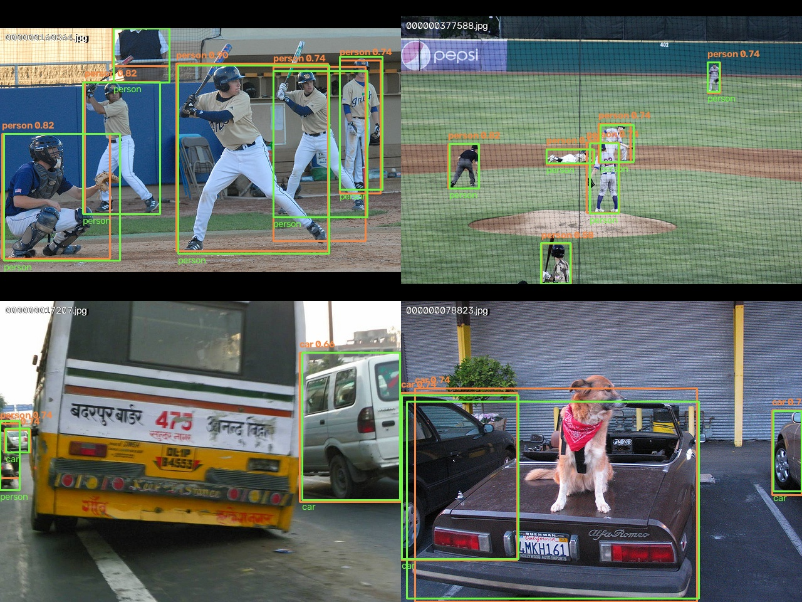
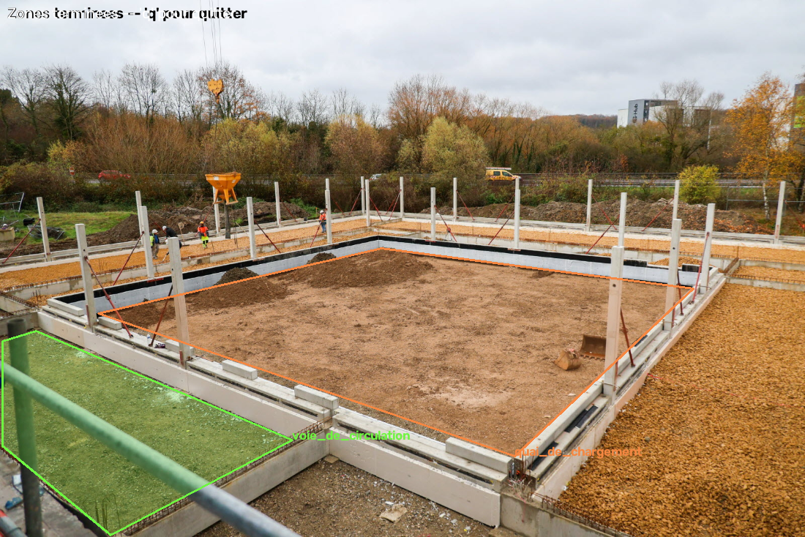

# EdgeSight — Détection embarquée et agent conversationnel

Projet personnel, conçu pour démontrer et explorer, de bout en bout, une
chaîne de vision par ordinateur pensée pour l'embarqué : détection de
personnes et de véhicules par un modèle full CNN quantifié INT8
(≤5 Mo), suivi multi-objets, journal d'événements et alertes en temps
réel, le tout interrogeable en langage naturel via un agent
conversationnel qui s'appuie sur un LLM local (tool calling).

Le projet est accompagné d'un **[rapport technique détaillé](docs/rapport.pdf)**
(36 pages) qui justifie chaque choix et présente les mesures associées
(voir [Rapport technique](#rapport-technique)).

**Compétences mises en œuvre :** constitution d'un jeu de données à
partir de COCO, fine-tuning et évaluation mAP d'un détecteur d'objets
(NanoDet-Plus), quantification INT8 post-entraînement (PTQ) avec une
toolchain maison, sans outil clé en main (export ONNX validé numériquement
contre PyTorch, quantification statique QDQ par canal, comparaison des méthodes de
calibration, calibration par lots pour borner la mémoire, mesure de la
perte de précision fp32 vs INT8), benchmark de latence et optimisation de
l'inférence CPU temps réel (ONNX Runtime, pipeline multi-thread),
tracking multi-objets (ByteTrack, filtre de Kalman), conception d'un
agent LLM local avec tool calling (llama.cpp), et banc d'évaluation
comparatif de LLM.



*Modèle INT8 déployé sur des images du jeu de test : détections en
orange, vérité terrain COCO en vert.*

## Sommaire

- [Structure du dépôt](#structure-du-dépôt)
- [Installation](#installation)
- [Démo](#démo)
- [Tester sur vos propres vidéos](#tester-sur-vos-propres-vidéos)
- [Ajouter une scène avec zones de danger](#ajouter-une-scène-avec-zones-de-danger)
- [Rapport technique](#rapport-technique)
- [Aller plus loin](#aller-plus-loin)
- [Contact](#contact)
- [Licence](#licence)

## Structure du dépôt

- `detection/` — préparation des données, entraînement, export ONNX,
  quantification INT8, évaluation
- `agent/` — tracking, journal d'événements, alertes, agent LLM et ses
  outils
- `demo/` — les 3 scripts de démo et leurs assets (`scenes/`,
  `silhouettes/`, `zone_previews/`, `custom/` pour vos vidéos)
- `config/` — réglages en YAML (démo, agent, tracker, zones)
- `setup/` — scripts de vérification de l'installation
- `docs/` — rapport technique (PDF et source LaTeX)

Déjà inclus dans le clone : les modèles ONNX (fp32 + INT8, 416/512/896px),
le checkpoint pré-entraîné, les configs NanoDet et les vidéos de démo.
Pas besoin de réentraîner pour tester les démos.

## Installation

Testé sous **Windows 11** (Git Bash), Python 3.12, GPU NVIDIA
(RTX 4060 Laptop). Commandes à lancer dans l'ordre, depuis la racine du
projet.

**Prérequis** : [uv](https://github.com/astral-sh/uv), `git`, `curl`,
`unzip`, un GPU NVIDIA (pour le LLM local).

**1. Environnement Python**

```bash
uv venv --python 3.12
source .venv/Scripts/activate
uv pip install -r detection/requirements.txt
uv pip install -r agent/requirements.txt
uv pip install -r demo/requirements.txt
```

**2. Code NanoDet** (figé sur le commit validé, sans écraser les configs
du projet)

```bash
git clone https://github.com/RangiLyu/nanodet.git /tmp/nanodet_upstream
git -C /tmp/nanodet_upstream checkout be9b4a9
mkdir -p detection/third_party/nanodet
cp -rn /tmp/nanodet_upstream/. detection/third_party/nanodet/
rm -rf /tmp/nanodet_upstream
```

**3. torch + dépendances NanoDet** — la version CPU suffit pour la démo ;
la version CUDA ne sert qu'à réentraîner.

```bash
uv pip install -r detection/requirements-torch-cpu.txt     # démo
# ou : uv pip install -r detection/requirements-torch-cu124.txt  (réentraînement)

grep -viE '^torch(>=|<|==)|^torchvision' detection/third_party/nanodet/requirements.txt \
  | uv pip install -r -
uv pip install -e detection/third_party/nanodet
```

**4. Patchs NanoDet** (compatibilité torch 2.x)

```bash
cd detection/third_party/nanodet
sed -i 's/^from torch._six import string_classes$/string_classes = str/' nanodet/data/collate.py
sed -i '/torch.backends.cudnn.benchmark = True/a\    torch.set_float32_matmul_precision("high")' tools/train.py
sed -i 's/if "pytorch-lightning_version" not in ckpt:/if "pytorch-lightning_version" not in ckpt and "state_dict" not in ckpt:/' tools/train.py
cd -
```

**5. llama.cpp** — prendre le build le plus récent sur
[les releases](https://github.com/ggml-org/llama.cpp/releases) (`TAG`),
et la variante CUDA la plus haute qui reste ≤ la « CUDA Version »
affichée par `nvidia-smi` (`CUDA`).

```bash
TAG=b11238
CUDA=12.4
mkdir -p agent/third_party/llama.cpp agent/models
curl -L -o agent/third_party/llama.cpp/llama.zip \
  "https://github.com/ggml-org/llama.cpp/releases/download/$TAG/llama-$TAG-bin-win-cuda-$CUDA-x64.zip"
curl -L -o agent/third_party/llama.cpp/cudart.zip \
  "https://github.com/ggml-org/llama.cpp/releases/download/$TAG/cudart-llama-bin-win-cuda-$CUDA-x64.zip"
unzip -oq agent/third_party/llama.cpp/llama.zip -d agent/third_party/llama.cpp
unzip -oq agent/third_party/llama.cpp/cudart.zip -d agent/third_party/llama.cpp
```

**6. Modèle LLM** — Granite-4.1-3B (~2,1 Go), depuis le dépôt officiel
[IBM](https://huggingface.co/ibm-granite/granite-4.1-3b-GGUF).

```bash
curl -L -o agent/models/granite-4.1-3b-Q4_K_M.gguf \
  "https://huggingface.co/ibm-granite/granite-4.1-3b-GGUF/resolve/main/granite-4.1-3b-Q4_K_M.gguf"
ls -l agent/models/granite-4.1-3b-Q4_K_M.gguf   # attendu : 2 099 501 664 octets
```

Si le serveur refuse ensuite de charger le modèle (`model is corrupted
or incomplete`), le téléchargement a été tronqué : le relancer.

**7. Vérifier l'installation**

```bash
uv run python setup/check_demo.py   # doit finir par "Tout est en place..."
```

Le script liste ce qui manque le cas échéant, étape par étape.

## Démo

3 scripts, chacun ajoutant une brique au précédent. À lancer depuis la
racine du projet.

| Script | Contenu |
|---|---|
| `01_detection_demo.py` | Détection seule : les boîtes du modèle INT8 |
| `02_tracking_demo.py` | + suivi multi-objets (identifiants persistants) |
| `03_live_agent_demo.py` | Pipeline complet : suivi, journal, alertes et assistant conversationnel |

```bash
uv run python demo/src/scripts/03_live_agent_demo.py
```

**`03_live_agent_demo.py` est la démonstration complète.** Il lance
lui-même le serveur LLM (quelques secondes au démarrage) et l'arrête en
quittant. Il ouvre la vidéo et une fenêtre **Assistant**, pré-remplie
d'exemples de questions, par exemple :

- « Combien de personnes y a-t-il en ce moment ? »
- « Préviens-moi si une personne reste plus de 10 secondes »
- « Alerte-moi si quelqu'un entre dans la zone centrale » (scène chantier)

Le panneau de droite affiche les outils appelés par l'agent et les
valeurs qu'ils ont renvoyées.

**Commandes dans la fenêtre vidéo** : `c` change de scène (4 vidéos,
puis une scène interactive de chantier où une silhouette suit la
souris), `r` redémarre la vidéo, `q` quitte.

**Réglages** (`config/demo.yaml`) : modèle utilisé (`active_model` :
896px par défaut, 512px ou 416px plus rapides), scènes du cycle. Pour
ajouter vos vidéos, voir [Tester sur vos propres
vidéos](#tester-sur-vos-propres-vidéos).

Pour garder le serveur LLM ouvert entre plusieurs lancements (évite de
recharger le modèle), le lancer à part ; la démo le réutilisera :

```bash
agent/third_party/llama.cpp/llama-server.exe \
  -m agent/models/granite-4.1-3b-Q4_K_M.gguf --jinja -ngl 99 -c 8192 --port 8080
```

### Scène interactive du chantier

La 5ᵉ scène du cycle n'est pas une vidéo : c'est une photo de chantier
sur laquelle on déplace une silhouette d'ouvrier, détectée par le
modèle comme une vraie personne. Deux zones de danger y sont
définies : `zone_centrale` (la fouille au centre, en orange sur
l'aperçu ci-dessous) et `zone_laterale` (en bas à gauche, en vert).
Pendant la démo, elles sont tracées en rouge sur la vidéo, avec leur
nom.



Commandes de la silhouette :

- **déplacer la souris** : la silhouette suit le curseur (aucun clic
  nécessaire) ;
- **molette** : agrandir ou réduire la silhouette ;
- **clic droit** : afficher ou masquer la silhouette.

**Scénario d'exemple : simuler une intrusion**

1. Lancer `03_live_agent_demo.py`, puis appuyer 4 fois sur `c` pour
   arriver sur la scène « chantier interactif ».
2. Dans la fenêtre Assistant, demander :
   « Alerte-moi si quelqu'un entre dans la zone centrale ». Le panneau
   de droite montre l'outil appelé :
   `set_zone_alert(zone_name="zone_centrale", object_class="person")`.
3. Placer la silhouette hors des zones, puis la faire entrer dans la
   zone centrale.
4. L'alerte s'affiche aussitôt en bannière sur la vidéo, puis l'agent
   la reformule en une phrase dans la fenêtre Assistant.
5. Sortir de la zone puis y revenir déclenche une nouvelle alerte.
   Demander ensuite « Combien de personnes sont entrées dans la zone
   centrale ? » pour obtenir le décompte.

Si la silhouette n'est pas détectée (pas de boîte autour d'elle),
l'agrandir avec la molette.

## Tester sur vos propres vidéos

Déposez un fichier vidéo (`.mp4`, `.avi`, `.mov`, `.mkv` ou `.webm`) dans
`demo/assets/custom/`, puis lancez n'importe laquelle des trois démos :
la vidéo est ajoutée à la fin du cycle, sans rien configurer. Appuyez sur
`c` jusqu'à elle : avec une seule vidéo ajoutée, c'est la 6ᵉ source, après
les 4 vidéos et la scène du chantier.

Son nom à l'écran vient du nom du fichier : `mon_parking-nuit.mp4`
s'affiche « perso - mon parking nuit ». Plusieurs vidéos sont classées
par ordre alphabétique. Elles bouclent en fin de lecture, et git les
ignore : elles ne risquent pas d'être commitées.

Ce qu'il faut savoir :

- le modèle ne reconnaît que les **personnes** et les **voitures** ;
- les objets qui paraissent petits à l'image (lointains) sont souvent
  manqués ; ceux de taille moyenne à grande sont bien détectés (voir la
  section « Arbitrage final » du rapport) ;
- sans zones définies, tout fonctionne (détection, suivi, questions à
  l'assistant, alertes de durée ou de nombre) sauf les alertes de zone.
  Pour en ajouter, voir la section suivante ;
- pour changer l'ordre de vos vidéos, préfixez leur nom
  (`1_entree.mp4`, `2_parking.mp4`…).

## Ajouter une scène avec zones de danger

Les zones sont définies par scène dans `config/zones.yaml`.
`agent/src/alerts/define_zones.py` permet de les dessiner à la souris,
puis les enregistre directement dans la config, en conservant ses
commentaires. Une nouvelle scène interactive est aussi ajoutée au cycle
de la démo (touche `c`). `--dry-run` affiche le résultat sans rien
écrire.

Deux types de scène :

- **Vidéo** : les zones sont testées sur les vraies détections de la
  vidéo. Le script n'affiche qu'une seule image pour dessiner les
  zones, la première par défaut (`--frame-index N` pour en choisir une
  autre). Les zones restent fixes : la vidéo doit donc être filmée en
  plan fixe.
- **Scène interactive** (image fixe + silhouette détourée qui suit la
  souris, comme le chantier fourni) : elle permet de **provoquer à la
  demande** des situations précises, difficiles à trouver dans les
  banques de vidéos libres de droits, comme une personne qui entre
  dans une zone de danger ou qui s'y attarde. On peut ainsi tester une
  alerte de façon reproductible, en choisissant soi-même le lieu, le
  moment et la trajectoire.

```bash
# Sur une vidéo
uv run python agent/src/alerts/define_zones.py demo/assets/custom/ma_video.mp4 \
  --scene-name mon_couloir --zones entree sortie

# Sur une image, avec une silhouette détourée (PNG RGBA) qui suit la souris
uv run python agent/src/alerts/define_zones.py demo/assets/scenes/06_mon_fond.jpg \
  --scene-name mon_site --zones zone_a zone_b \
  --sprite demo/assets/silhouettes/ma_silhouette.png
```

Les zones se dessinent **une par une, dans l'ordre des noms passés à
`--zones`** : avec `--zones entree sortie`, le premier polygone dessiné
devient `entree`, le second `sortie`. Le nom de la zone en cours est
affiché en haut de la fenêtre.

Clic gauche : ajouter un point ; clic droit : annuler ; `n` : fermer la
zone et passer à la suivante ; `r` : recommencer la zone ; `q` : terminer. Un aperçu est
enregistré dans `demo/assets/zone_previews/<scene-name>.png`.

## Rapport technique

Le [rapport technique](docs/rapport.pdf) documente l'ensemble du projet :
les choix faits à chaque étape, les alternatives écartées, et les
mesures qui les justifient (mAP, latence, taille, taux de réussite de
l'agent). C'est la référence pour toute question sur le *pourquoi*
d'un choix ; le README ne couvre que l'installation et la démo.

| Question | Section du rapport |
|---|---|
| Pourquoi NanoDet-Plus plutôt qu'un autre détecteur ? | Choix d'architecture de détection |
| Comment le jeu de données a-t-il été construit ? | Préparation des données |
| Comment le modèle a-t-il été entraîné, et pourquoi 896px ? | Entraînement — trois générations de modèle |
| Comment fonctionne la quantification INT8, et que coûte-t-elle en précision ? | Quantification INT8 — toolchain maison |
| Quels compromis entre précision et vitesse ? | Performance et compromis précision/vitesse |
| Comment le suivi et le journal d'événements fonctionnent-ils ? | Suivi multi-objets et journalisation des événements |
| Pourquoi Granite-4.1-3B, et comment l'agent a-t-il été évalué ? | Agent conversationnel |
| Comment l'ensemble tourne-t-il en temps réel ? | Intégration système et démonstration live |
| Limites et pistes d'amélioration | Synthèse générale et perspectives |

Le rapport est disponible en PDF, [`docs/rapport.pdf`](docs/rapport.pdf),
à côté de sa source LaTeX, [`docs/rapport.tex`](docs/rapport.tex)
(figures dans `docs/figures/`). Pour le recompiler après modification,
depuis `docs/` : `tectonic rapport.tex` ou `latexmk -pdf rapport.tex`.

## Aller plus loin

- **Reproduire tout le projet** (données COCO, entraînement,
  quantification) : installer torch CUDA à l'étape 3, puis vérifier avec
  `uv run python setup/check_project.py`. Les scripts sont dans
  `detection/src/`, dans l'ordre (`01_data/` → `04_evaluate/`).
- **Comparer les détections à la vérité terrain** sur le jeu de test
  (données COCO de `01_data/` requises) :
  `uv run python detection/src/04_evaluate/visualize_test_predictions.py`
  affiche 4 images au hasard (`r` : nouvelles images, `g` : vérité
  terrain, `q` : quitter) ; `--save fichier.png` enregistre la grille.

## Contact

Pour toute question technique : jean02800@gmail.com

## Licence

[MIT](LICENSE) pour le code de ce dépôt. Ne couvre ni le code tiers
(`detection/third_party/`, `agent/third_party/`), ni les vidéos de démo
(licence Pixabay), ni les poids de modèles tiers (NanoDet-Plus, Granite),
chacun sous sa propre licence. Les figures `docs/figures/predictions_*.jpg`
reprennent des images COCO val2017 issues de Flickr (licences CC BY et
CC BY-NC, identifiants listés dans le rapport).
